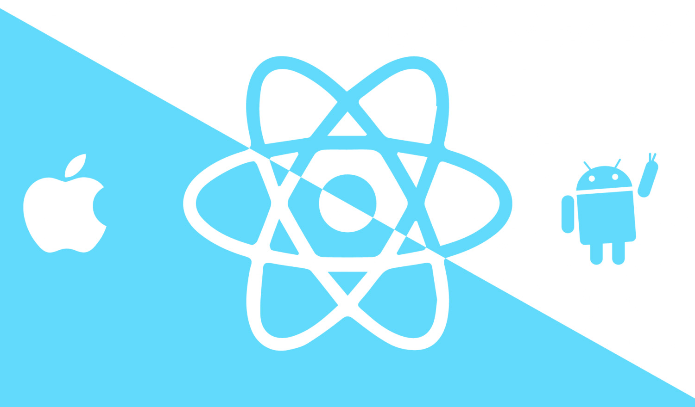
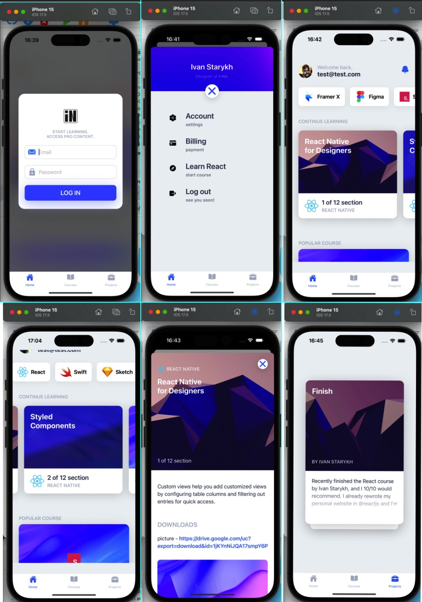

# mobileApp

# React Native 

---
[React Native](https://facebook.github.io/react-native/) is a popular Javascript framework that builds on top of React by using native components to create a real mobile app indistinguishable from one made using Xcode or Android Studio. The main difference with native development is that you get to use CSS, hot-reload, Javascript and other familiar techniques that the Web has grown over the past decades. Most importantly, you're building for both iOS and Android using the same codebase.

[//]: # (## Course Files)

[//]: # (1. [React Native for Designers]&#40;&#41;)

[//]: # (2. [Styled Components]&#40;&#41;)

[//]: # (3. [Props and Icons]&#40;&#41;)

[//]: # (4. [Static Data and Loop]&#40;&#41;)

[//]: # (5. [States and Animations]&#40;&#41;)

[//]: # (6. [Redux]&#40;&#41;)

[//]: # (7. [Fetch API Data]&#40;&#41;)

[//]: # (8. [Screens and Navigation]&#40;&#41;)

[//]: # (9. [Passing Data]&#40;&#41;)

[//]: # (10. [GraphQL with Contentful]&#40;&#41;)

[//]: # (11. [HTML and Markdown]&#40;&#41;)

[//]: # (12. [Adapting for iPad and Android]&#40;&#41;)
# About
This is a cross-platform (iOS, Android) mobile application built with React Native using Expo. The project is divided into components that are reused throughout. For authentication, there is a form with email and password, which is handled through Google's Firebase. Redux is used for managing the application's data state and user interface. The backend utilizes GraphQL and the Hygraph API service. The application includes animations and utilizes Lottie, which is a JSON-based animation file format. This application can be used as a template with further modifications depending on the project.

# Screenshots

---

## Install Node

Before starting, you'll need the Node package manager (NPM) for installing React and Expo. To install Node, you need to head to their site and [**download**](https://nodejs.org/en/) the version appropriate to your system. You can also install node using [Homebrew](https://brew.sh) (Mac only) if you prefer.

## Install Xcode

If you're on a Mac, I highly recommend [installing Xcode](https://itunes.apple.com/ca/app/xcode/id497799835?mt=12) for the required **Command Line Tools** and for using the iOS Simulator. Xcode also comes with [Git](https://git-scm.com), which is wonderful for development.

## Install Android Studio

[installing ANDROID STUDIO](https://developer.android.com/studio)

## Install Expo

[Expo](https://expo.io) will allow us to have a development environment for creating our app. Go to Terminal and type this command and press Enter.
```sh
sudo npm install expo-cli --global
```

Go to their Quick Start [guide](https://expo.io/learn) for more detailed instructions.

Go to your new project's folder and start the environment.
```sh
expo start 

npm run ios
npm run android
```

## Install Libraries
```sh
npm install
```

